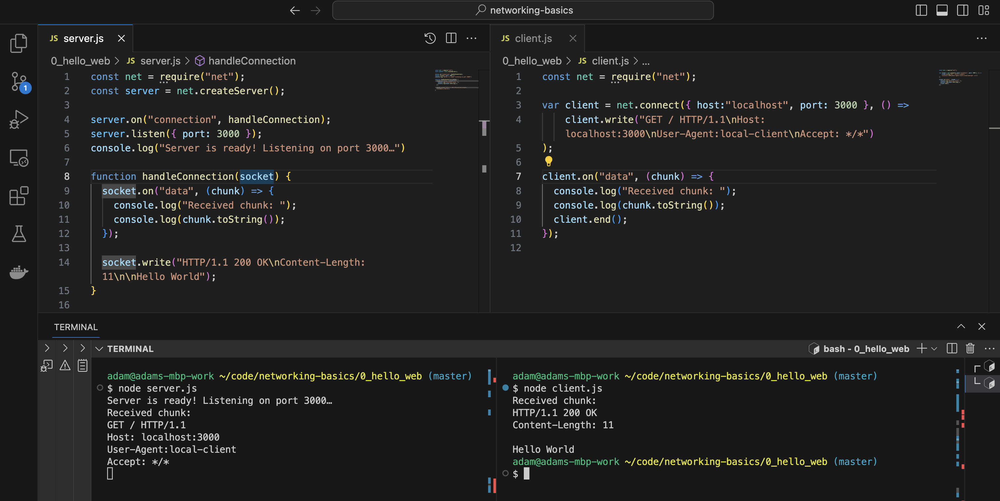

# How Networks Work, And Don't

This repository is meant to accompany classes at C<>DE University. This repository contains many versions of low-level servers and clients, intended to demonstrate various principles of how web servers work, including sockets, HTTP requests, file servers, etc. 

## Before We Begin...

Students joining this workshop are expected to have:
- An interest in learning how the internet works
- Basic familiarity with the terminal and command line on your own computer (e.g. navigating directories, executing scripts)
- Node.js installed on your computer (ideally v18, but v16 or v20 is OK)
- Optional: Python3 installed on your computer (v3.8 or higher)
- Optional: git installed on your own computer, and the ability to clone a repository (nothing advanced required).
- A code editor / integrated development environment installed locally on your computer (e.g. Visual Studio Code).

To start, clone this repository into a working directory on your computer and open it in your code editor. You can do this by opening a New Window in Visual Studio Code selecting "Clone Git Repository", entering the URL of this repository (copied from your browser), and then selecting a local directory to save it to. You can also download this repository as a .zip file instead and open it from the downloads folder. 

## The Client and the Server  
In this lesson, we'll start our first web server and connect to it a few ways on our own computer. After you have downloaded this repository, you can disconnect from the internet. 

Navigate to the directory `example-js` in your terminal and run the server using node.js:

`> node server.js`

It should be running now. It will look like it is hanging, because it is running and waiting for input. Open the file `server.js` in your code editor, and you can see that is is listening on port 3000 on the localhost (your computer). We'll learn more about what that means during class today. For now, we'd like to send a message your server, and see how it responds. 

The first way to do this is to use everybody's favorite web client, the browser. Type in `http://localhost:3000/`to the URL bar and hit enter. You have made a request to your own server, and you should get a response that says "Hello, World" rendered in the browser. Congratulations! 

While the server is running in one terminal, open up a second terminal (ideally side-by-side) and run the command-line based client. This will make a request to your server similar to what a browser does, but from the command line:

`> node client.js`

You should see some output in both terminals, including our message "Hello World" in the client terminal. 
 
 
  A VS Code window with the files `server.js` and `client.js` being displayed (top) and executed in the terminal (bottom).

#### Optional: A Python Client with a JavaScript Server
If you have a working version of Python 3 installed, the following little exercise can really help to understand the magic of networking. So far, we have run both a client and server using node.js (JavaScript). We also used the browser as a client without looking under the hood. Now, we'll explicitly use Python as our client, to demonstrate that communicating over a network is independent of programming language. 

In one terminal, start your server again (`node server.js`). In another terminal window, navigate to the folder called `example-py`, where you will find a file called `server.py`file and one called `client.py`. With the node server running in one terminal window, start the python client in another window, by running

`> python client.py`

As with the previous exercise, the client is sending a message to the server, and getting a response. Here, we see that the data itself is exchanged and the programming language can interpret that data, but it does not matter which language you use. You can also swap this around, running the server in python and the client in JavaScript, for example.

A further example in the directory `example-c`shows the same in the C programming language. If you use this version, you will have to compile the code first, and after any change. On my computer (MacBook set up with Xtools), I can compile with: 

`gcc server.c -o server.out``

and

`gcc client.c -o client.out`

And then start the server and client respectively with `./server.out` and `./client.out`. 

All three versions (JavaScript, Python, and C) should be fully interoperable: you should be able to start a server with any of the three, and connect with any of the three clients, as long as the socket (combination of IP Address and Port) is the same in both files. 
 
### Ports and Sockets

The first thing we really want to learn about is how ports and sockets work. To see this in action, we will change the port that the server listens on, and the port that the various clients we have connect to. 

To do this, stop your server by typing Ctrl+C in its terminal window. Now, edit the file `server.js` to listen on an another port, for example, 3001 instead of 3000. Now, try to connect to the server *without* yet changing the port, for example, by navigating to `localhost:3000` in your browser or by running `node client.js`as it is. In either case, you should get an error on the client and you should not see any requests getting to the server. This is because you are still making a request on port 3000, but you have nothing listening there. Now, change the port in your client to make a request on your new port (for example, 3001). You should see the "Hello World" message once again. 

##### Lesson 1: Client, Server, Sockets, Ports

Start the server (`$ python server.py `) and in another terminal, start the client (`$ python3 client.py `). This is running on the _localhost_.

Start the server again, and in another terminal, check that it is running using netstat: `netstat -an | grep 65432`.

Change the port of the server, and run the client. What happens? Now fix it so they can communicate again.
